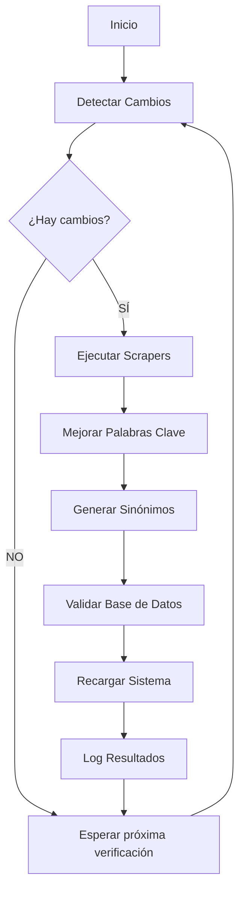

# 🤖 Sistema de Automatización UTS Chatbot v1.3.0 ✨ OPTIMIZADO

Sistema inteligente de actualización automática para el chatbot especializado en **Ingeniería de Sistemas UTS**. Mantiene sincronizada la información con la web oficial mediante detección de cambios y scrapers automáticos. **v1.3.0 incluye optimizaciones críticas para el sistema híbrido**.

## 🎯 ¿Qué hace el sistema? - MEJORADO v1.3.0

### 1. **Detección Inteligente de Cambios** ✅ OPTIMIZADO
- 🔍 Monitorea https://www.uts.edu.co/sitio/ingenieria-de-sistemas/ cada 2-6 horas
- 📊 Compara contenido actual con snapshots cached anteriores  
- 🚨 Detecta modificaciones en secciones (presentación, malla, perfil, etc.)
- ⚡ Activación automática solo cuando hay cambios reales
- ✨ **NUEVO v1.3.0**: Compatible con sugerencias estáticas y sistema híbrido

### 2. **Actualización Automática de Contenido** ✨ RENOVADO v1.3.0
- 🕷️ **Scrapers selectivos**: Solo ejecuta scrapers de secciones modificadas
- 🔄 **Regeneración de sinónimos**: Mejora automática del NLP con filtros optimizados
- 🏷️ **Optimización de palabras clave**: Keywords contextuales con threshold 0.4
- 🧠 **Reload inteligente**: Recarga base de conocimiento con filtros mejorados
- 📝 **Logging detallado**: Registro completo compatible con sistema híbrido
- ✨ **NUEVO**: Actualización de sugerencias estáticas automática
- ✨ **MEJORADO**: Optimización para búsqueda híbrida BD local + web

### 3. **Programación Multi-Plataforma**
- 🪟 **Windows**: Task Scheduler con scripts .bat
- 🐧 **Linux/Mac**: Cron jobs con scripts .sh
- ☁️ **Servicios cloud**: Compatible con GitHub Actions, Render cron
- 📊 **Monitoreo**: Logs automáticos con rotación por fecha

## 🚀 Comandos Disponibles

### Comandos Básicos
```bash
# Actualización completa (scrapers + keywords + sinónimos)
npm run auto-update

# Actualización rápida (solo keywords + sinónimos)
npm run auto-update-quick

# Detectar cambios únicamente
npm run detect-changes

# Actualización inteligente (solo si hay cambios)
npm run auto-check-update
```

### Comandos Manuales
```bash
# Ejecutar todos los scrapers
npm run scrapers

# Mejorar palabras clave
npm run improve-keywords

# Generar sinónimos
npm run generate-synonyms
```

## ⚙️ Configuración Automática

### Windows (Administrador requerido)
```cmd
# Ejecutar como Administrador
scripts\setup-automation-windows.bat
```

### Linux/Mac
```bash
# Dar permisos y ejecutar
chmod +x scripts/setup-automation-unix.sh
./scripts/setup-automation-unix.sh
```

## 📋 Tareas Programadas

| Tarea | Frecuencia | Descripción |
|-------|------------|-------------|
| **Verificación** | Cada 6 horas | Detecta cambios en páginas web |
| **Actualización Completa** | Diario 2:00 AM | Actualización completa del sistema |
| **Actualización Inteligente** | Cada 2 horas | Solo actualiza si hay cambios |

## 📊 Monitoreo

### Ver Logs
```bash
# Logs del sistema
tail -f logs/chatbot-*.log

# Logs de automatización (Linux/Mac)
tail -f logs/automation.log
```

### Verificar Estado
```bash
# Windows - Ver tareas programadas
schtasks /query /tn "UTS-Chatbot*"

# Linux/Mac - Ver cron jobs
crontab -l
```

## 🔄 Flujo de Trabajo Automático



## 🛠️ Personalización

### Cambiar Frecuencias

**Windows (Task Scheduler):**
```cmd
# Cambiar a cada 4 horas
schtasks /change /tn "UTS-Chatbot-Smart-Update" /ri 240
```

**Linux/Mac (Crontab):**
```bash
# Editar crontab
crontab -e
# Cambiar 0 */2 * * * por 0 */4 * * * (cada 4 horas)
```

### Agregar URLs de Monitoreo

Editar `scripts/change-detector.cjs`:
```javascript
await this.detectWebChanges([
    'https://www.uts.edu.co/sitio/nueva-seccion/', // Nueva URL
    // ... URLs existentes
]);
```

## 📁 Estructura de Archivos

```
scripts/
├── auto-update-system.cjs      # Sistema principal de automatización
├── change-detector.cjs         # Detector de cambios
├── improve-keywords.cjs        # Mejora de palabras clave
├── generate-synonyms.cjs       # Generador de sinónimos
├── setup-automation-windows.bat # Configuración Windows
└── setup-automation-unix.sh   # Configuración Linux/Mac

cache/                          # Snapshots para detección
├── database.json              # Estado anterior de BD
├── web_*.json                 # Estado anterior de páginas
└── detection_report.json     # Último reporte

logs/
├── chatbot-*.log             # Logs del chatbot
└── automation.log            # Logs de automatización
```

## ⚠️ Consideraciones

### Requisitos
- **Node.js** en PATH del sistema
- **Permisos de escritura** en directorio del proyecto
- **Conexión a internet** estable
- **Base de datos** configurada correctamente

### Recursos
- **CPU**: Bajo impacto (solo durante actualizaciones)
- **Memoria**: ~50MB durante ejecución
- **Disco**: ~10MB para cache y logs
- **Red**: Descargas según cambios detectados

### Seguridad
- Las tareas se ejecutan con permisos del usuario actual
- No requiere permisos de administrador después de la configuración
- Logs incluyen timestamps para auditoría

## 🚨 Resolución de Problemas

### Error: "npm: command not found"
```bash
# Verificar PATH
echo $PATH

# Agregar Node.js al PATH
export PATH="/usr/local/bin:$PATH"
```

### Error: "Permission denied"
```bash
# Dar permisos al proyecto
chmod -R 755 /ruta/del/proyecto

# Verificar permisos de escritura
ls -la logs/
```

### Error: "Database locked"
```bash
# Verificar que el servidor no esté corriendo durante actualizaciones
npm run detect-changes
```

## 📞 Soporte

Si necesita ayuda con la automatización:

1. **Revisar logs** en `logs/` para errores específicos
2. **Ejecutar manualmente** los comandos para debugging
3. **Verificar configuración** de tareas programadas
4. **Comprobar conectividad** a páginas web de UTS

---

### 🎉 ¡Sistema Configurado!

Una vez configurado, el chatbot se mantendrá **automáticamente actualizado** sin intervención manual, detectando y procesando nuevo contenido de la UTS en tiempo real.
