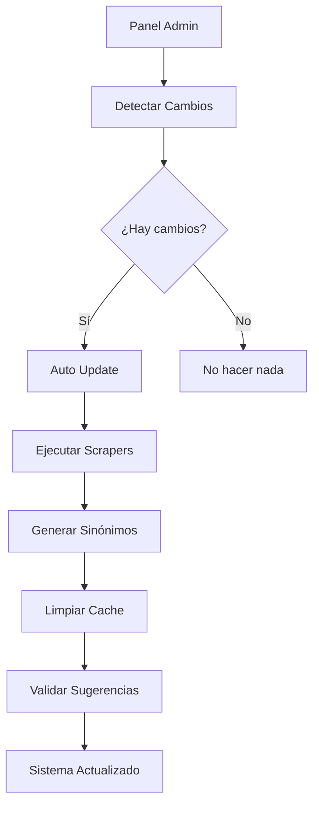

# 🤖 Sistema de Automatización - Chatbot UTS v1.3.1

## 📋 Overview
El sistema de automatización mantiene el chatbot actualizado mediante **control web integrado** en el panel de administración. **No requiere configuración de tareas programadas del sistema operativo.**

---

## 🎯 Control desde Panel Admin

### 🖥️ **Interfaz Web de Automatización**
**Acceso**: `https://tu-dominio.com/admin` → **Sección Mantenimiento**

#### **Funciones Disponibles**:
```
🔍 Detectar Cambios    → Verifica cambios en sitio UTS
🔄 Auto Update         → Actualización completa del sistema  
⚡ Update Inteligente  → Actualiza solo si hay cambios
🎛️ Toggle Automático   → Activa/desactiva automatización
📊 Ver Estado         → Estado actual del sistema
📋 Logs en Tiempo Real → Monitoreo de procesos
```

### 🔐 **Autenticación y Seguridad**
- **Token de acceso**: `admin123` (configurable en `.env`)
- **Control granular**: Cada función ejecutable por separado
- **Logs integrados**: Resultados visibles en tiempo real
- **Diseño user-friendly**: Optimizado para personal no técnico

---

## 🛠️ Componentes del Sistema

### 1. **Detector de Cambios** (`change-detector.cjs`)
- **Función**: Monitorea páginas web de UTS para detectar modificaciones
- **Método**: Compara hashes del contenido HTML
- **Frecuencia**: Bajo demanda desde panel admin
- **Output**: Reporta cambios detectados en interfaz web

### 2. **Sistema de Auto-Update** (`auto-update-system.cjs`)
- **Función**: Orquesta actualización completa del sistema
- **Proceso**:
  ```
  1. ✅ Ejecuta scrapers activos (4/5)
  2. ✅ Regenera sinónimos automáticos
  3. ✅ Limpia cache del sistema
  4. ✅ Recarga base de conocimiento
  5. ✅ Valida sugerencias v1.3.0
  ```
- **Ejecutor**: Panel admin con visualización de progreso

### 3. **Validador de Sugerencias** (`validate-suggestions.mjs`)
- **Función**: Valida calidad del sistema de sugerencias estáticas
- **Análisis**: Relevancia, coherencia y cobertura
- **Output**: Métricas integradas en dashboard admin

---

## ⚙️ Configuración del Sistema

### 📝 **Archivo de Configuración** (`config/automation.json`)
```json
{
  "checkInterval": 21600000,
  "autoUpdate": true,
  "notifications": true,
  "retryAttempts": 3,
  "sources": [
    "https://www.uts.edu.co/sitio/ingenieria-de-sistemas/",
    "https://www.uts.edu.co/sitio/aspirantes/",
    "https://www.uts.edu.co/sitio/estudiantes/",
    "https://www.uts.edu.co/sitio/tecnologia-en-desarrollo-de-sistemas-informaticos/"
  ]
}
```

### 🎮 **Uso Recomendado**
1. **Acceder al panel admin**: `/admin` con token
2. **Verificar estado**: Revisar métricas del sistema
3. **Detectar cambios**: Usar botón "Detectar Cambios"
4. **Actualizar si necesario**: "Auto Update" o "Update Inteligente"
5. **Monitorear logs**: Ver progreso en tiempo real

---

## 🚀 Comandos de Línea (Opcional)

### **Ejecución Manual desde Terminal**
```bash
# Detección de cambios
npm run detect-changes

# Actualización completa
npm run auto-update  

# Actualización inteligente (solo si hay cambios)
npm run auto-check-update

# Validar sugerencias
npm run validate:suggestions
```

### **Scripts Individuales**
```bash
# Ejecutar scrapers
node scripts/run-scrapers.cjs

# Generar sinónimos
node scripts/generate-synonyms.cjs

# Validar sugerencias
node scripts/validate-suggestions.mjs
```

---

## 📊 Ventajas del Sistema Integrado

### ✅ **Control Web vs Tareas Programadas**

| Característica | Panel Admin | Tareas Programadas |
|----------------|-------------|-------------------|
| **Facilidad de uso** | 🟢 Interfaz visual | 🟡 Requiere terminal |
| **Control inmediato** | 🟢 Ejecuta al instante | 🟡 Horarios fijos |
| **Monitoreo** | 🟢 Logs en vivo | 🟡 Solo archivos |
| **Seguridad** | 🟢 Token integrado | 🟡 Permisos SO |
| **Flexibilidad** | 🟢 Tareas individuales | 🟡 Todo o nada |
| **Multiplataforma** | 🟢 Web universal | 🟡 Scripts específicos |

### 🎯 **Beneficios Clave**
- **🎮 User-friendly**: No requiere conocimientos técnicos
- **🔐 Seguro**: Autenticación integrada y controlada
- **📊 Transparente**: Logs y métricas en tiempo real
- **⚡ Inmediato**: Control instantáneo de procesos
- **📱 Accessible**: Funciona desde cualquier dispositivo
- **🌐 Universal**: Sin dependencias del sistema operativo

---

## 🔧 Arquitectura del Sistema

### **Flujo de Automatización**


### **Integración con v1.3.1**
- ✅ **Compatible con sugerencias estáticas**
- ✅ **Optimizado para sistema híbrido**
- ✅ **Scrapers selectivos** (4 activos + 1 preservado)
- ✅ **Cache invalidation automático**
- ✅ **Logs estructurados** para debugging
- 🆕 **Análisis automático de calidad** de respuestas
- 🆕 **Sistema inteligente** de detección de limitaciones

---

## 📋 Mantenimiento y Monitoreo

### **Revisión Recomendada**
- 🔍 **Semanal**: Verificar estado general en panel admin
- 🔄 **Quincenal**: Ejecutar "Detectar Cambios" manualmente
- 📊 **Mensual**: Revisar métricas de sugerencias y rendimiento

### **Indicadores de Salud**
```
🟢 Verde:  Sistema operando normalmente
🟡 Amarillo: Advertencias menores (revisar logs)
🔴 Rojo: Errores críticos (requiere atención)
```

### **Resolución de Problemas**
1. **Error de scrapers**: Verificar conectividad web UTS
2. **Base datos**: Validar esquema y permisos
3. **Sugerencias**: Re-ejecutar validador
4. **Cache**: Limpiar cache desde panel admin

---

## ✅ Conclusión

El **sistema de automatización integrado** en el panel admin es la **solución recomendada** para mantener el chatbot actualizado:

- 🎯 **Simplicidad**: Un clic para cada tarea
- 🔒 **Seguridad**: Control autenticado y auditado  
- 📊 **Visibilidad**: Progreso y resultados en tiempo real
- 🚀 **Eficiencia**: Actualizaciones solo cuando es necesario
- 🌐 **Universalidad**: Funciona desde cualquier navegador

**Recomendación**: Usar exclusivamente el panel admin para todas las operaciones de automatización.